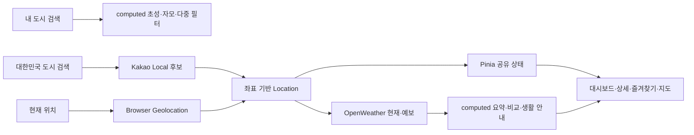
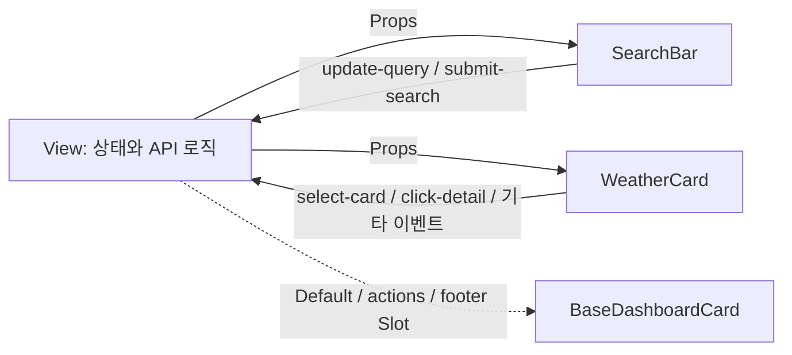

# 🌤️ SKALA Weather

Vue 3 수업의 단계별 실습을 **한국어 위치 검색 → 실시간 날씨 조회 → 도시 상태 관리** 흐름으로 확장한 날씨 대시보드입니다.

**Directive → Composition API → Component → Vue Router → Pinia → Axios → UI Library**를 하나의 앱으로 연결하고, PrimeVue와 VueUse를 활용해 검색·비교·즐겨찾기·지도·테마 기능을 구현했습니다.

[실행 데모](https://skala-vue-olive.vercel.app) · [실습 대비 확장](#실습-대비-확장-포인트) · [코드 근거](#코드-근거-바로가기) · [실행 방법](#실행-방법)

[](./docs/images/dashboard-overview.png)

_Evidence 01 · Pinia에 등록된 도시 상태와 OpenWeather의 실제 날씨를 결합한 메인 대시보드_

## 30초 핵심 요약

| 핵심 영역 | 과제 외 확장 구현 |
| --- | --- |
| **한국어 검색 UX** | `ㅅ`, `ㅅㅇ`, `서ㅇ`, `서우`, `ㅅㅓㅇㅜㄹ` 검색과 쉼표 기반 다중 도시 필터링 |
| **반응형 데이터 계산** | 대시보드 통계, 24시간 예보, 현지 날짜 기준 5일 요약, 도시 비교 결과를 `computed`로 계산 |
| **상태와 화면 흐름** | Pinia로 도시·즐겨찾기·단위·테마를 공유하고 Router query로 검색 화면 상태 복원 |
| **실제 위치 데이터** | Kakao Local·Browser Geolocation에서 좌표를 얻고 OpenWeather 현재 날씨·예보와 연결 |
| **서비스형 UX** | 최근 검색, 즐겨찾기, 도시 비교, 날씨 지도, 생활 날씨 안내, 라이트·다크 모드 제공 |

> **검색 흐름 분리:** 내 도시 검색은 이미 받은 데이터를 `computed`로 즉시 필터링하고, 대한민국 도시 검색은 완성된 지역명을 Kakao Local에서 조회한 뒤 사용자가 선택한 좌표로 OpenWeather를 호출합니다.

## 실습 대비 확장 포인트

| PDF 학습 영역 | 기본 실습 중심 | 이번 프로젝트의 심화·추가 구현 |
| --- | --- | --- |
| **1장 · 개발 환경** | Vite 프로젝트 구성 | `views`·`stores`·`api`·`composables`·`utils`로 역할 분리, API 키 환경 변수화 |
| **2장 · Directive** | 목록·조건·입력·이벤트 처리 | 한글 IME 대응 입력, API 상태별 렌더링, 날씨 Tone 클래스, 카드 이벤트 충돌 방지 |
| **3장 · Composition API** | `ref`·`computed`·`watch` | 자모·다중 검색, 통계·예보·비교 계산, URL·API·저장소·테마 동기화 |
| **4장 · Component** | Props·Emits·Slot | Default·`actions`·`footer` Slot, 세분화된 이벤트, 검색 Composable 재사용 |
| **5장 · Vue Router** | 홈·상세·Not Found | 중첩 탐색, 비교·즐겨찾기·지도, 좌표 기반 동적 경로, 복귀 경로·스크롤 복원 |
| **6장 · Pinia** | 온도 단위 전역 상태 | 대시보드·즐겨찾기·검색 도시·테마 공유, 좌표 키와 LocalStorage 지속성 |
| **7장 · Axios** | 단일 날씨 API 호출 | Kakao·OpenWeather 다중 API, 현재 위치, 병렬 요청, 오류·Race Condition 처리 |
| **8장 · UI Library** | Element Plus 활용 | PrimeVue Custom Preset과 VueUse 기반 Toast·Dialog·Skeleton·테마·디바운스 적용 |

## 화면으로 확인하는 구현

상단 대표 화면을 포함한 세 장의 이미지는 실제 외부 API를 호출한 실행 결과입니다. 이미지를 누르면 원본 크기로 확인할 수 있습니다.

### Evidence 02 · Kakao 지역 후보 → 좌표 기반 날씨 조회

[](./docs/images/kakao-search-result.png)

`계룡시` 행정구역 후보를 선택한 뒤 해당 좌표의 OpenWeather 현재 날씨를 조회합니다. 임의의 OpenWeather 도시 문자열을 바로 사용하는 대신, 사용자가 대한민국 지역 후보를 확인하도록 구성했습니다.

### Evidence 03 · 3시간 예보 40개 → `computed` 5일 요약

[](./docs/images/computed-daily-summary.png)

도시의 `timezone`을 반영해 예보를 현지 날짜별로 묶고, 일별 최저·최고 기온과 최대 강수 확률, 정오에 가까운 대표 날씨를 계산합니다.

## 학습 개념과 설계 연결

| 학습 개념 | 적용 기준 | 구현 결과 |
| --- | --- | --- |
| **Directive** | 화면 상태와 사용자 동작을 템플릿에서 표현 | 로딩·오류·빈 결과·정상 결과 분기, API 목록 반복, 동적 클래스와 이벤트 수식어 |
| **`computed`** | 기존 상태에서 계산할 수 있는 파생값 | 한글 검색, 필터·정렬, 통계, 예보 요약, 비교 문구가 원본 변경에 따라 자동 갱신 |
| **`watch` / `watchEffect`** | 상태 변경 이후 필요한 부수 효과 | API 재호출, URL query 복원, LocalStorage 저장, 테마 메타 색상과 수업 로그 동기화 |
| **Slot / Props / Emits** | 레이아웃과 상태 책임을 분리 | 공통 카드 레이아웃을 재사용하고 자식은 입력·동작만 부모에게 전달 |
| **Composable** | 두 화면에서 반복되는 상태와 비동기 흐름 분리 | 도시 검색과 도시 비교가 Kakao 후보·디바운스·오래된 응답 방지 로직 공유 |
| **Vue Router / Pinia** | URL이 필요한 화면 상태와 앱 전역 상태를 구분 | 탐색·상세·비교·즐겨찾기 경로와 도시·단위·테마 상태를 독립적으로 관리 |
| **Axios / 외부 API** | 위치와 날씨 공급자를 좌표로 연결 | Kakao·Geolocation의 좌표를 OpenWeather 현재 날씨·예보 요청에 공통 사용 |
| **PrimeVue / VueUse** | 반복 UI와 브라우저 기능을 검증된 생태계로 보완 | 사용자 피드백·삭제 확인·로딩·테마·저장·디바운스를 기존 디자인과 통합 |

## 데이터 흐름



## 코드 근거 바로가기

평가자가 설명과 실제 구현을 바로 비교할 수 있도록 핵심 로직의 GitHub 줄 링크를 기능별로 묶었습니다.

### 검색과 Composition API

- [한글 초성·자모·다중 검색과 대시보드 통계](./src/views/WeatherHomeView.vue#L195-L426)
- [검색 상태와 URL query 양방향 동기화](./src/views/WeatherHomeView.vue#L145-L193)
- [24시간 예보와 현지 날짜 기준 5일 요약](./src/views/WeatherDetailView.vue#L233-L349)
- [한국어 조사와 도시 비교 결과 계산](./src/views/WeatherCompareView.vue#L177-L268)

### 컴포넌트 설계

- [Default·actions·footer Slot](./src/components/exercise/BaseDashboardCard.vue#L1-L45)
- [SearchBar Props·Emits와 한글 입력 처리](./src/components/exercise/SearchBar.vue#L4-L102)
- [WeatherCard Props·Emits와 이벤트 수식어](./src/components/exercise/WeatherCard.vue#L7-L177)
- [Kakao 검색 Composable과 요청 순번 제어](./src/composables/useLocationSearch.js#L29-L140)

### Router와 전역 상태

- [중첩·동적·추가 라우트와 화면 복원](./src/router/index.js#L3-L92)
- [좌표 기반 도시·즐겨찾기 State와 Action](./src/stores/weatherStore.js#L140-L261)
- [VueUse 온도 단위·시스템 테마 상태](./src/stores/configStore.js#L19-L91)
- [상세 페이지 복귀 경로와 이전·다음 도시](./src/views/WeatherDetailView.vue#L115-L203)

### API와 사용자 피드백

- [OpenWeather 현재 날씨·예보·역지오코딩](./src/api/weatherApi.js#L1-L51)
- [Kakao Local 주소 검색](./src/api/locationApi.js#L1-L20)
- [현재 위치 기반 날씨 검색](./src/views/WeatherSearchView.vue#L250-L334)
- [생활 날씨 안내 규칙](./src/utils/weatherWarnings.js#L1-L76)
- [Ventusky 좌표·레이어·도시 핀 URL](./src/views/WeatherMapView.vue#L29-L109)

## 장별 상세 구현

<details>
<summary><strong>1장 · 개발 환경 — 단일 실습에서 서비스 구조로 확장</strong></summary>

- 화면 단위는 `views`, 재사용 UI는 `components/exercise`, 전역 상태는 `stores`로 분리했습니다.
- 외부 요청은 `api`, 반복되는 지역 검색 흐름은 `composables`, 표시·저장·생활 안내 규칙은 `utils`에 배치했습니다.
- OpenWeather와 Kakao 키는 Vite 환경 변수로 분리해 실제 값이 저장소에 포함되지 않도록 구성했습니다.
- 앱에서 사용하지 않는 이전 실습 파일은 보존하되, 최종 제출 흐름은 `App.vue`와 연결된 코드만 사용합니다.

</details>

<details>
<summary><strong>2장 · Vue 문법과 Directive — API 상태와 한글 입력까지 확장</strong></summary>

기본 과제의 `v-for`, `v-if`, 속성 바인딩, 이벤트 수식어를 다음과 같이 확장했습니다.

- 2단계였던 온도 문구를 `매우 더움 / 포근함 / 서늘함` 3단계로 변경했습니다.
- Mock Data 카드뿐 아니라 API 도시, 시간별 예보, 5일 예보, 카카오 지역 후보, 생활 참고 안내를 `v-for`와 고유한 `:key`로 렌더링합니다.
- `v-if / v-else-if / v-else`로 로딩, API 오류, 검색 전, 검색 결과 없음, 정상 결과를 구분했습니다.
- 검색창은 한글 IME 입력 과정이 자연스럽도록 `v-model` 대신 `:value`와 `@input`을 유지하고, 변경값을 Emit으로 부모에게 전달합니다.
- 카드 전체 클릭과 내부의 상세보기·즐겨찾기·삭제가 충돌하지 않도록 `@click.stop`을 적용했습니다.
- 정렬 Select, 즐겨찾기 Toggle, 지도 도시 선택에는 `v-model`을 적용해 입력 방식에 따라 두 바인딩 방법을 비교했습니다.
- 날씨 종류에 따라 `weather-tone-*` 클래스를 동적으로 바인딩해 API 상태와 시각 표현을 연결했습니다.

**코드 확인:** [3단계 온도 문구](./src/components/exercise/WeatherCard.vue#L59-L69) · [한글 입력 처리](./src/components/exercise/SearchBar.vue#L73-L93) · [카드 이벤트 수식어](./src/components/exercise/WeatherCard.vue#L95-L177)

</details>

<details>
<summary><strong>3장 · Composition API — 검색·통계·예보와 상태 동기화</strong></summary>

**`computed` 확장**

- 초성 문자열과 완성형 한글의 전체 자모 문자열을 각각 계산합니다. `ㅅ`, `ㅅㅇ`, `서ㅇ`, `서우`, `ㅅㅓㅇㅜㄹ` 모두 서울과 일치합니다.
- 쉼표로 검색어를 나눠 `서울, 부산`처럼 여러 도시를 한 번에 찾습니다.
- 검색 결과 → 즐겨찾기만 보기 → 기온·습도·이름 정렬 순서로 파생 목록을 계산합니다.
- **한눈에 보기**에서 등록 도시 수, 평균 기온, 가장 더운 도시, 즐겨찾기 수를 계산합니다.
- 검색 결과와 즐겨찾기 페이지의 개수·평균 기온, 두 도시의 기온·습도·풍속·기압 비교표도 자동으로 다시 계산합니다.
- OpenWeather의 3시간 간격 예보 40개를 도시의 현지 날짜별로 묶고, 일별 최저·최고 기온과 최대 강수 확률을 계산해 5일 요약으로 가공합니다.
- 도시 비교 문구에서는 마지막 글자의 종성을 계산해 `이/가` 조사를 자연스럽게 선택합니다.
- 상세 진입 출처를 계산해 검색·즐겨찾기·지도·비교 화면에 맞는 복귀 경로와 버튼 문구를 만듭니다.

**`watch`와 `watchEffect` 확장**

- 과제에서 요구한 검색어 `watchEffect`와 상태바 문구 `watch` 로그를 유지했습니다.
- 검색어·정렬·즐겨찾기 필터를 URL query와 양방향으로 동기화해 새로고침과 뒤로가기 후에도 화면 상태를 복원합니다.
- Pinia의 대시보드·즐겨찾기 도시가 바뀌면 해당 페이지가 실제 날씨를 다시 불러옵니다.
- 동적 상세 경로의 `cityId`가 바뀌면 같은 컴포넌트에서 새로운 도시의 날씨와 예보를 다시 요청합니다.
- 대시보드·즐겨찾기·검색 도시는 deep `watch`로 저장하고, 최근 검색은 검색 실행 시 목적별 목록에 명시적으로 저장합니다.
- 선택한 테마가 바뀌면 브라우저의 `theme-color`도 함께 갱신합니다.

파생값은 `computed`, API 호출·저장·라우팅처럼 상태 변경 뒤 실행해야 하는 동작은 `watch`로 구분했습니다.

**코드 확인:** [한글 자모·다중 검색](./src/views/WeatherHomeView.vue#L195-L379) · [대시보드 한눈에 보기](./src/views/WeatherHomeView.vue#L381-L426) · [24시간·5일 예보 계산](./src/views/WeatherDetailView.vue#L233-L349) · [watch 활용](./src/views/WeatherSearchView.vue#L81-L131)

</details>

<details>
<summary><strong>4장 · Vue Component — Slot·Props·Emits와 Composable 재사용</strong></summary>

기본 4개 컴포넌트 분리에서 더 나아가, 같은 컴포넌트를 여러 라우트에서 재사용할 수 있도록 확장했습니다.

- `BaseDashboardCard`
  - 제목·설명은 Props로 받고 본문은 Default Slot으로 주입합니다.
  - 헤더 버튼용 `actions`, 하단 버튼용 `footer` Named Slot을 추가했습니다.
  - Slot 학습 목적을 유지하기 위해 PrimeVue Card로 교체하지 않고 직접 만든 공통 컴포넌트를 유지했습니다.
- `SearchBar`
  - 검색어와 표시 옵션을 Props로 받고 `update-query`, `submit-search` 이벤트를 Emits로 전달합니다.
  - 대시보드, 대한민국 도시 검색, 도시 비교의 좌·우 검색창에서 재사용합니다.
- `WeatherCard`
  - 날씨·즐겨찾기·대시보드 등록 상태를 Props로 받습니다.
  - 기본 `select-card`, `click-detail` 외에 `toggle-favorite`, `add-dashboard`, `remove-dashboard` 이벤트를 추가했습니다.
- `LocationSuggestionList`
  - 카카오 검색 후보, 로딩, 오류를 Props로 받고 사용자가 고른 지역 객체를 `select` 이벤트로 전달합니다.
- `useLocationSearch`
  - 자동완성 API 호출, 디바운스, 행정구역 필터, 좌표 중복 제거, 요청 순번 제어를 View 밖으로 추출했습니다.
  - 대한민국 도시 검색과 도시 비교의 좌·우 검색 흐름에서 같은 로직을 재사용합니다.



각 자식 컴포넌트의 자체 스타일은 `scoped`로 격리했습니다. `BaseDashboardCard` 외곽과 Slot으로 주입된 콘텐츠를 함께 배치하는 규칙은 Slot 콘텐츠가 부모 스코프에서 컴파일되는 특성을 고려해 공통 스타일에 두었습니다.

**코드 확인:** [Named Slot](./src/components/exercise/BaseDashboardCard.vue#L23-L44) · [SearchBar 통신](./src/components/exercise/SearchBar.vue#L4-L102) · [WeatherCard 통신](./src/components/exercise/WeatherCard.vue#L7-L93)

</details>

<details>
<summary><strong>5장 · Vue Router — 기능별 화면과 복원 가능한 URL 상태</strong></summary>

기본 홈·소개·동적 상세·Not Found 라우트에 실제 서비스형 화면 전환을 추가했습니다.

- 모든 View를 Lazy Loading하고 Catch-all Route를 유지했습니다.
- 탐색 화면을 중첩 라우트로 구성하고 검색과 지도를 하위 화면으로 분리했습니다.
- 즐겨찾기, 도시 비교, 날씨 지도 라우트를 추가하고 반응형 내비게이션에서 이동할 수 있게 했습니다.
- Mock Data의 `city_01` 대신 `위도_경도` 기반 키를 동적 `cityId`로 사용해 API로 검색한 도시도 상세 URL을 가질 수 있습니다.
- 검색어·정렬·즐겨찾기 필터와 비교할 두 도시를 URL query에 저장했습니다.
- 상세 화면은 진입한 화면에 따라 검색·지도·비교·즐겨찾기로 돌아갈 경로를 계산합니다.
- 대시보드 도시의 이전·다음 상세 페이지 이동, 경로별 문서 제목, 스크롤 위치 복원을 추가했습니다.

**코드 확인:** [중첩·동적·추가 라우트](./src/router/index.js#L3-L76) · [스크롤·문서 제목](./src/router/index.js#L77-L92) · [상세 복귀 경로 계산](./src/views/WeatherDetailView.vue#L115-L202)

</details>

<details>
<summary><strong>6장 · Pinia — 좌표 기반 도시·즐겨찾기·설정 상태</strong></summary>

과제의 `configStore`를 유지하면서 실제 서비스 상태를 담당하는 `weatherStore`를 추가했습니다.

- `configStore`
  - 섭씨·화씨 상태, 단위 기호 Getter, 단위 전환 Action을 메인·카드·상세·비교·지도에 공통 적용했습니다.
  - 시스템·라이트·다크 테마 상태도 함께 관리합니다.
- `weatherStore`
  - 기본 대시보드 도시 5개, 사용자가 검색한 도시, 즐겨찾기 도시를 모든 라우트에서 공유합니다.
  - 도시 추가·삭제·기본값 복원·즐겨찾기 전환을 Action으로 제공합니다.
  - 좌표를 공통 식별자로 사용해 카카오와 OpenWeather의 도시명 표기가 달라도 같은 장소를 연결합니다.
  - 대시보드·즐겨찾기 키를 `computed Set`으로 만들어 포함 여부를 반복해서 빠르게 확인합니다.
  - 좌표가 같은 후보 중복 제거, 기본 도시 대표 좌표 재사용, 이전 숫자 ID 즐겨찾기 마이그레이션을 처리했습니다.
  - 새로고침 후에도 대시보드·즐겨찾기·검색 도시를 복원하도록 브라우저 저장소와 동기화했습니다.

**코드 확인:** [대시보드·즐겨찾기 State와 Action](./src/stores/weatherStore.js#L140-L236) · [Store 자동 저장 watch](./src/stores/weatherStore.js#L238-L261) · [단위·테마 Getter와 Action](./src/stores/configStore.js#L19-L91)

</details>

<details>
<summary><strong>7장 · Axios와 외부 데이터 — 지역 후보부터 실시간 예보까지</strong></summary>

Mock Data는 기본 도시의 대표 좌표에만 사용하고, 화면에 표시되는 날씨는 실제 API 응답으로 교체했습니다.

```text
카카오 지역명 검색 → 대한민국 행정구역 후보와 좌표 선택
                    → OpenWeather 현재 날씨 조회
                    → 상세 화면에서 5 Day / 3 Hour Forecast 조회
```

- `axios.create()`로 OpenWeather 날씨, OpenWeather Geocoding, Kakao Local 인스턴스를 분리하고 Base URL·제한 시간·인증 정보를 설정했습니다.
- OpenWeather 2.5의 Current Weather와 5 Day / 3 Hour Forecast를 사용합니다.
- 카카오 Local 주소 검색에서 대한민국 행정구역 후보를 받은 뒤 선택한 좌표로 날씨를 조회합니다. `계룡` 검색 시 임의의 지명을 바로 사용하지 않고 사용자가 `계룡시` 후보를 선택할 수 있습니다.
- 브라우저 Geolocation으로 현재 좌표를 받은 뒤 OpenWeather 역지오코딩으로 도시명을 확인하고 현재 날씨를 표시합니다.
- 대시보드와 즐겨찾기는 `Promise.allSettled()`로 여러 도시를 동시에 요청해 일부 요청이 실패해도 성공 결과를 유지합니다.
- 상세와 도시 비교는 서로 독립적인 API를 `Promise.all()`로 병렬 호출합니다.
- 요청 순번을 두어 사용자가 도시를 빠르게 바꿨을 때 늦게 도착한 이전 응답이 최신 화면을 덮지 않게 했습니다.
- 상세 화면에서 24시간 예보, 5일 요약, 강수·기온·바람 기준 생활 참고 안내를 제공합니다. 생활 참고 문구는 앱에서 계산한 값이며 공식 기상 특보가 아님을 명시했습니다.
- 날씨 지도는 Ventusky의 좌표·레이어 기반 Embed를 사용하고, 선택 도시의 현재 수치는 OpenWeather에서 별도로 조회합니다.

**코드 확인:** [OpenWeather 요청](./src/api/weatherApi.js#L1-L51) · [Kakao 요청](./src/api/locationApi.js#L1-L20) · [후보 중복·오래된 응답 처리](./src/composables/useLocationSearch.js#L29-L105) · [현재 위치 검색](./src/views/WeatherSearchView.vue#L250-L334) · [Ventusky 좌표 URL](./src/views/WeatherMapView.vue#L29-L109)

</details>

<details>
<summary><strong>8장 · UI Library — PrimeVue Custom Preset과 VueUse</strong></summary>

수업에서 다른 UI 라이브러리 사용도 허용되어 Element Plus 대신 **PrimeVue**를 선택했습니다.

- PrimeVue `Button`, `Select`, `ToggleSwitch`, `Skeleton`, `Toast`, `ConfirmDialog`를 실제 대시보드 동작에 적용했습니다.
- 삭제·초기화는 ConfirmDialog로 확인하고, 검색·즐겨찾기·새로고침 결과는 Toast로 피드백합니다.
- Aura 테마를 바탕으로 기존 흑백 디자인에 맞는 색상 Preset을 구성했습니다.
- `data-theme`에 맞춰 PrimeVue와 자체 CSS가 함께 바뀌는 시스템·라이트·다크 모드를 구현했습니다.
- 필요한 PrimeVue 컴포넌트만 개별 import하고 각 View를 지연 로딩했습니다.

PrimeVue와 함께 **VueUse**도 적용했습니다.

- `useColorMode`: 시스템 테마 감지와 HTML 테마 속성 반영
- `useLocalStorage`: 온도 단위 저장
- `useDebounceFn`: 입력 중 불필요한 카카오 호출과 URL 변경 감소

**코드 확인:** [PrimeVue Preset과 서비스 등록](./src/main.js#L14-L78) · [Toast·ConfirmDialog 배치](./src/App.vue#L44-L47) · [VueUse 테마·저장](./src/stores/configStore.js#L22-L80) · [VueUse 디바운스](./src/composables/useLocationSearch.js#L93-L127)

</details>

<details>
<summary><strong>9장 · 종합 확장 — 검색 구조와 서비스형 기능</strong></summary>

**검색을 두 흐름으로 분리한 이유**

| 내 도시 검색                                                         | 대한민국 도시 검색                                                        |
| -------------------------------------------------------------------- | ------------------------------------------------------------------------- |
| 이미 API로 불러온 대시보드 목록을 빠르게 필터링합니다.               | 카카오 API에서 실제 대한민국 행정구역과 좌표를 찾습니다.                  |
| 초성·부분 자모·쉼표 다중 검색을 지원합니다.                          | 완성된 한글 두 글자 이상을 입력하면 후보를 보여줍니다.                    |
| 입력 즉시 `computed`가 결과를 계산하며 추가 API를 호출하지 않습니다. | 입력을 잠시 멈춘 뒤 API를 호출하고 후보 선택 후 OpenWeather를 호출합니다. |

전국의 모든 장소에 초성 검색을 직접 적용하려면 먼저 전체 지명 데이터가 필요합니다. 따라서 로컬 대시보드에서는 학습한 검색 알고리즘을 활용하고, 실제 도시 탐색에서는 카카오 후보 선택으로 정확한 좌표를 얻도록 역할을 나눴습니다.

**코드 확인:** [로컬 자모 검색](./src/views/WeatherHomeView.vue#L195-L379) · [API 검색어 검증과 디바운스](./src/composables/useLocationSearch.js#L9-L127)

**과제 외 종합 기능**

- 기본 대표 도시 5개를 대시보드에 제공하고 사용자가 삭제·추가·기본값 복원할 수 있게 했습니다.
- 검색한 도시를 즐겨찾기에 저장하고 전용 라우트에서 실제 날씨와 평균 기온을 다시 조회합니다.
- 두 도시의 기온·체감·습도·풍속·기압·구름량을 비교하고 자연스러운 한국어 결과 문구를 계산합니다.
- Ventusky Embed URL에 선택 좌표·레이어·대시보드 도시 핀을 전달하고, 선택 도시의 OpenWeather 현재 수치를 함께 보여줍니다.
- 현재 및 24시간 예보의 기온·강수 확률·풍속·날씨 코드를 바탕으로 생활 날씨 안내를 계산합니다. 이 안내는 공식 기상 특보가 아님을 화면에 명시했습니다.
- 시스템 설정을 따르는 라이트·다크 모드와 섭씨·화씨 전환을 모든 라우트에 공통 적용했습니다.

</details>

## 사용 API와 환경 변수

- OpenWeather Current Weather Data
- OpenWeather 5 Day / 3 Hour Forecast
- OpenWeather Reverse Geocoding
- Kakao Local 주소 검색
- Browser Geolocation API
- Ventusky Embed

프로젝트 루트의 `.env`에 다음 키를 설정합니다. 실제 키 값은 저장소에 올리지 않습니다.

```dotenv
VITE_OPENWEATHER_API_KEY=발급받은_OpenWeather_Key
VITE_KAKAO_REST_API_KEY=발급받은_Kakao_REST_API_Key
```

## 실행 방법

```sh
npm install
npm run dev
```

제출 전 확인:

```sh
npm run lint
npm run build
```

## 기술 스택

- Vue 3 Composition API
- Vue Router
- Pinia
- Axios
- PrimeVue
- VueUse
- Vite
