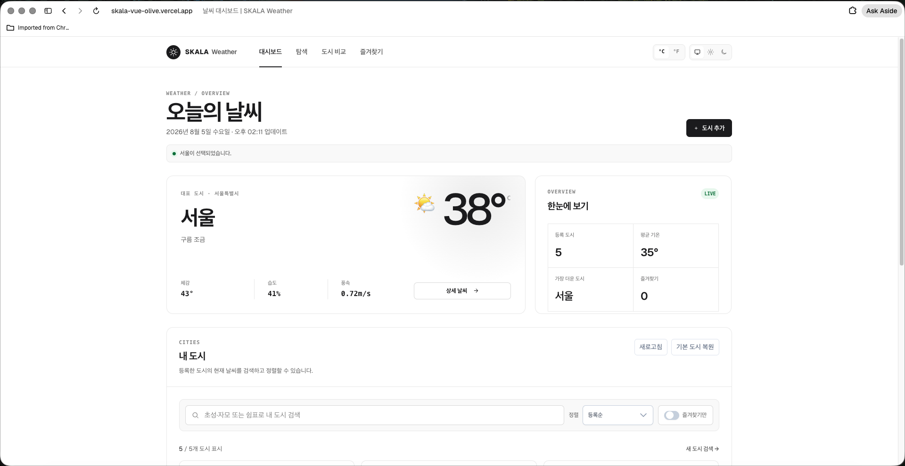
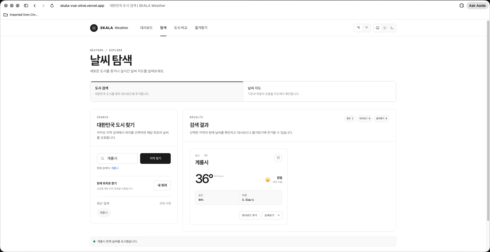
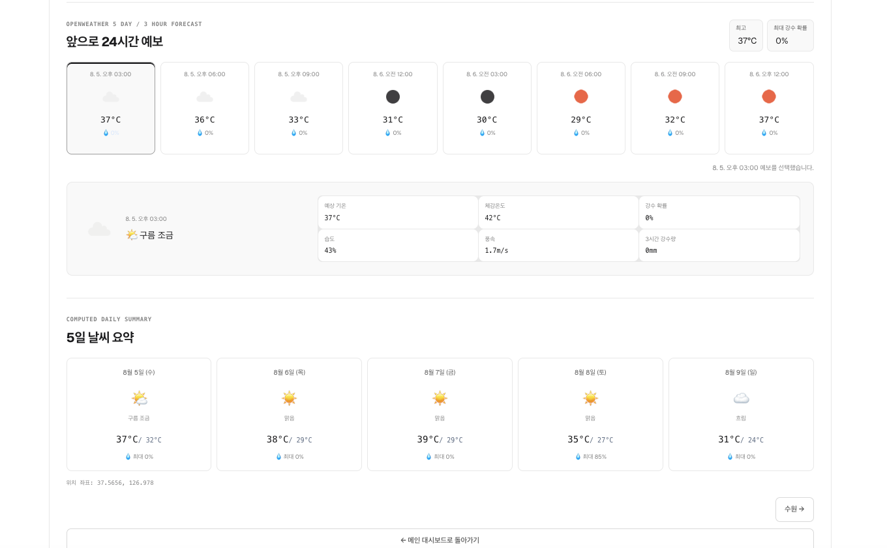
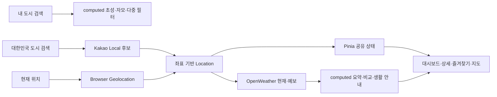
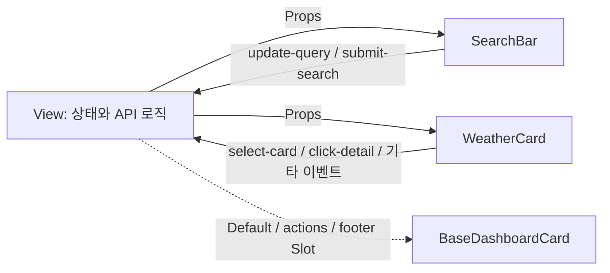

# SKALA Weather

**한국어 위치 검색 → 실시간 날씨 조회 → 도시 상태 관리** 흐름으로 확장한 날씨 대시보드입니다. Vue 3 수업의 단계별 실습(Directive → Composition API → Component → Vue Router → Pinia → Axios → UI Library)을 하나의 앱으로 연결했습니다.

> **README 작성 기준** · PDF의 기본 실습 요구사항만 수행한 항목은 제외하고, 최종 `App.vue`에 실제로 연결된 **추가·변경 구현 전체**를 정리했습니다.

[](https://skala-vue-olive.vercel.app)
[](#실습-외-구현-기능-전체)
[](#코드-근거-바로가기)
[](#실행-방법)

## 실습 외 구현 기능 전체

기능명을 누르면 해당 구현 코드로 바로 이동합니다.

**빠른 이동** · [검색·위치](#검색과-위치-탐색) · [대시보드·상태](#대시보드와-전역-상태) · [상세·예보](#상세-날씨와-데이터-가공) · [비교·지도](#도시-비교와-날씨-지도) · [Router](#router-기반-화면-흐름) · [컴포넌트·UI](#컴포넌트와-사용자-인터페이스) · [API·예외 처리](#api-요청과-예외-처리)

### 검색과 위치 탐색

- **[초성·혼합 자모 검색](./src/views/WeatherHomeView.vue#L195-L354)** — `ㅅ`, `ㅅㅇ`, `서ㅇ`, `서우`, `ㅅㅓㅇㅜㄹ` 입력을 모두 `서울`과 일치시키는 한글 분해·접두 검색을 구현했습니다.
- **[쉼표 다중 검색](./src/views/WeatherHomeView.vue#L333-L354)** — `서울, 부산`처럼 여러 검색어를 나눠 등록 도시를 한 번에 필터링합니다.
- **[검색 흐름 분리](./src/views/WeatherHomeView.vue#L341-L379)** — 내 도시는 이미 받은 데이터를 `computed`로 즉시 검색하고, [전국 검색](./src/views/WeatherSearchView.vue#L152-L248)만 외부 API를 호출하도록 역할을 나눴습니다.
- **[대한민국 행정구역 자동완성](./src/composables/useLocationSearch.js#L9-L105)** — 완성된 한글 두 글자 이상을 Kakao Local에서 조회하고, 행정구역만 남긴 뒤 같은 좌표의 후보를 제거합니다.
- **[정확한 좌표 선택 검색](./src/views/WeatherSearchView.vue#L152-L248)** — 여러 후보는 사용자가 선택하고, 정확히 일치하거나 후보가 한 곳일 때만 Enter·검색 버튼으로 바로 날씨를 조회합니다.
- **[검색 디바운스](./src/composables/useLocationSearch.js#L93-L127)** — 입력이 멈춘 뒤 400ms 후 후보를 조회해 타이핑 중 불필요한 API 호출을 줄였습니다.
- **[최근 검색 저장소 분리](./src/utils/weatherStorage.js#L23-L34)** — [대시보드 필터 검색](./src/views/WeatherHomeView.vue#L447-L497)과 [API 지역 검색](./src/views/WeatherSearchView.vue#L124-L150)을 목적별 목록으로 나눠 각각 최대 5개까지 저장하고, API 검색도 [재사용·삭제](./src/views/WeatherSearchView.vue#L336-L343)할 수 있게 했습니다.
- **[현재 위치 날씨](./src/views/WeatherSearchView.vue#L250-L334)** — 사용자가 버튼을 누른 경우에만 위치 권한을 요청하고, 좌표 → 역지오코딩 → 대한민국 도시 날씨 순서로 연결합니다.
- **[검색 결과 상태 계산](./src/views/WeatherSearchView.vue#L53-L64)** — 결과 수와 대시보드·즐겨찾기 등록 수를 `computed`로 집계하고, [결과 카드 동작](./src/views/WeatherSearchView.vue#L345-L382)으로 추가·즐겨찾기·상세 이동을 제공합니다.

### 대시보드와 전역 상태

- **[기본 대표 도시 5곳](./src/data/weatherMock.js#L1-L120)** — Mock Data는 [기본 도시의 이름·행정구역·대표 좌표 초기값](./src/stores/weatherStore.js#L23-L32)으로만 사용하고, 화면의 기온·습도·바람은 [OpenWeather 응답](./src/views/WeatherHomeView.vue#L71-L112)으로 교체했습니다.
- **[사용자 대시보드 관리](./src/stores/weatherStore.js#L204-L236)** — 검색 도시 추가, 카드 삭제, 기본 도시 복원을 Store Action으로 제공하고, [확인창·알림·전체 새로고침](./src/views/WeatherHomeView.vue#L559-L619)으로 결과를 안내합니다.
- **[다중 기준 정렬](./src/views/WeatherHomeView.vue#L124-L134)** — 등록순, 기온 높은 순·낮은 순, 습도 높은 순, 한글 도시 이름순 옵션을 정의하고 [정렬 `computed`](./src/views/WeatherHomeView.vue#L356-L379)로 카드 순서를 계산합니다.
- **[즐겨찾기 필터](./src/views/WeatherHomeView.vue#L356-L379)** — 검색 결과에 즐겨찾기 조건을 추가로 적용하고 [선택 상태를 URL에도 보존](./src/views/WeatherHomeView.vue#L143-L193)합니다.
- **[한눈에 보기](./src/views/WeatherHomeView.vue#L381-L400)** — 평균 기온과 가장 더운 도시는 `computed`로 계산하고, 등록 도시·즐겨찾기 수는 Pinia 목록 길이와 함께 [요약 패널](./src/views/WeatherHomeView.vue#L684-L710)에 표시합니다.
- **[대표 도시와 갱신 시각](./src/views/WeatherHomeView.vue#L402-L426)** — 첫 번째 등록 도시를 대표 날씨로 표시하고 [API 요청이 성공한 시각](./src/views/WeatherHomeView.vue#L95-L109)을 기록해 마지막 갱신 시각을 보여줍니다.
- **[즐겨찾기 전용 페이지](./src/views/WeatherFavoritesView.vue#L33-L91)** — 저장 도시의 실제 현재 날씨를 다시 조회하고, 도시 수와 평균 기온을 `computed`로 계산합니다.
- **[좌표 기반 도시 식별](./src/stores/weatherStore.js#L12-L111)** — 위·경도를 공통 키로 사용해 공급자별 도시명 차이를 흡수하고 기본 도시 좌표 정규화와 중복 방지를 처리합니다.
- **[`computed Set` 등록 여부 계산](./src/stores/weatherStore.js#L173-L187)** — 대시보드·즐겨찾기 좌표 키를 `Set`으로 파생해 여러 카드와 검색 결과에서 포함 여부를 반복 확인합니다.
- **[브라우저 상태 복원](./src/stores/weatherStore.js#L140-L171)** — 대시보드·즐겨찾기·검색 도시를 복원하고 이전 숫자 ID 즐겨찾기를 좌표 기반 구조로 마이그레이션하며, 변경값은 [deep `watch`로 자동 저장](./src/stores/weatherStore.js#L238-L261)합니다.

### 상세 날씨와 데이터 가공

- **[상세 기상 관측 계산](./src/views/WeatherDetailView.vue#L206-L231)** — 현재·체감·최저·최고 기온을 선택 단위로 가공하고, 습도·기압·풍속·풍향·구름량·가시거리·강수·적설을 [관측 화면](./src/views/WeatherDetailView.vue#L397-L487)에 표시합니다.
- **[날씨 코드 한국어 표준화](./src/utils/weatherDisplay.js#L1-L110)** — OpenWeather Condition ID를 기준으로 날씨 문구·이모지·시각 Tone을 일관되게 변환합니다.
- **[3단계 온도 상태 문구](./src/components/exercise/WeatherCard.vue#L59-L69)** — 기본 2단계 조건을 `매우 더움 / 포근함 / 서늘함` 세 단계로 확장했습니다.
- **[앞으로 24시간 예보 계산](./src/views/WeatherDetailView.vue#L233-L290)** — 3시간 간격 예보 8개와 도시 현지 시각을 계산하고 [선택 가능한 카드 UI](./src/views/WeatherDetailView.vue#L510-L602)로 표시합니다.
- **[선택 시간대 상세·요약](./src/views/WeatherDetailView.vue#L256-L290)** — 24시간 최고 기온·최대 강수 확률을 계산하고 선택 시각의 체감·습도·풍속·3시간 강수량을 [상세 패널](./src/views/WeatherDetailView.vue#L517-L600)에 표시합니다.
- **[현지 날짜 기준 5일 요약](./src/views/WeatherDetailView.vue#L292-L341)** — 40개 예보를 도시 날짜별로 묶어 최저·최고 기온, 최대 강수 확률, 정오에 가까운 대표 날씨를 계산합니다.
- **[생활 날씨 안내](./src/utils/weatherWarnings.js#L1-L76)** — 현재·24시간 예보의 폭염, 한파, 강수, 강풍, 뇌우, 눈 조건을 계산해 생활 참고 문구를 제공합니다.

### 도시 비교와 날씨 지도

- **[두 도시 실시간 비교](./src/views/WeatherCompareView.vue#L197-L268)** — 현재 기온, 체감온도, 습도, 풍속, 기압, 구름량과 기온 차이를 같은 기준으로 계산합니다.
- **[비교 도시 검색·교체](./src/views/WeatherCompareView.vue#L19-L106)** — 대시보드·즐겨찾기 빠른 선택과 좌우 독립 Kakao 검색을 함께 제공하고 [두 도시 위치를 즉시 교체](./src/views/WeatherCompareView.vue#L270-L274)합니다.
- **[자연스러운 한국어 비교 문구](./src/views/WeatherCompareView.vue#L177-L195)** — 도시 이름의 받침을 판별해 `성남시가`, `서울이`처럼 `이/가` 조사를 자동 선택합니다.
- **[Ventusky 인터랙티브 지도](./src/views/WeatherMapView.vue#L11-L62)** — 선택 좌표와 기온·강풍 레이어를 Embed URL로 조합하고 [iframe·레이어·시간축 UI](./src/views/WeatherMapView.vue#L146-L215)로 연결합니다.
- **[대시보드 도시 지도 핀](./src/views/WeatherMapView.vue#L33-L47)** — 등록 도시 좌표를 Ventusky URL의 핀으로 전달하고 선택 도시의 OpenWeather 현재 수치를 [지도 옆 요약 패널](./src/views/WeatherMapView.vue#L218-L260)에 표시합니다.
- **[지도 선택 상태 자동 보정](./src/views/WeatherMapView.vue#L109-L119)** — 다른 화면에서 선택 도시를 삭제하면 남은 첫 도시로 선택값을 바꾸고 현재 날씨를 다시 조회합니다.
- **[지도 사용성 보완](./src/views/WeatherMapView.vue#L121-L165)** — iframe 지도 초기화, 크게·작게 보기, 원본 지도 새 탭 열기, 선택 도시 상세 이동을 제공합니다.

### Router 기반 화면 흐름

- **[기능별·중첩 라우트](./src/router/index.js#L3-L76)** — 탐색 아래 도시 검색·지도를 중첩하고 즐겨찾기·도시 비교 화면을 독립 경로로 추가했습니다.
- **[URL 검색 상태 동기화](./src/views/WeatherHomeView.vue#L143-L193)** — 검색어·정렬·즐겨찾기 필터를 `?q=&sort=&favorites=`에 저장하고 새로고침·뒤로가기 시 복원합니다.
- **[API 검색어 URL 동기화](./src/views/WeatherSearchView.vue#L81-L105)** — 대한민국 도시 검색어를 `?q=`와 양방향으로 동기화하고 상세 화면에서 돌아오거나 새로고침하면 [검색 결과를 다시 조회](./src/views/WeatherSearchView.vue#L384-L389)합니다.
- **[비교 상태 URL 저장](./src/views/WeatherCompareView.vue#L156-L167)** — 비교 중인 두 도시 좌표 키를 `?left=&right=`에 기록하고 [초기 선택값을 query에서 복원](./src/views/WeatherCompareView.vue#L31-L44)합니다.
- **[좌표 기반 식별자](./src/stores/weatherStore.js#L11-L14)** — API로 새로 찾은 도시도 `lat_lon` 형식의 키를 사용하고, [검색 도시를 기억·조회](./src/stores/weatherStore.js#L163-L202)해 [동적 상세 Route](./src/router/index.js#L50-L55)를 직접 새로고침할 수 있게 했습니다.
- **[진입 화면별 복귀](./src/views/WeatherDetailView.vue#L149-L204)** — 상세 진입 출처를 query로 추적해 대시보드·검색·즐겨찾기·지도·비교 중 알맞은 화면과 상태로 돌아갑니다.
- **[이전·다음 도시 이동](./src/views/WeatherDetailView.vue#L104-L147)** — 같은 상세 컴포넌트에서 대시보드의 앞·뒤 도시로 이동하고 경로 변경을 감시해 API를 다시 요청합니다.
- **[문서 제목·스크롤 복원](./src/router/index.js#L77-L92)** — 라우트별 브라우저 제목, 뒤로가기 위치 복원, query만 변경될 때의 스크롤 유지를 적용했습니다.
- **[Vercel Deep Link 새로고침](./vercel.json#L1-L9)** — 하위 경로를 직접 열거나 새로고침해도 SPA의 `index.html`로 전달되도록 Rewrite를 구성했습니다.

### 컴포넌트와 사용자 인터페이스

- **[Multi-slot 공통 카드](./src/components/exercise/BaseDashboardCard.vue#L23-L44)** — Default Slot 외에 헤더 `actions`와 하단 `footer` Named Slot을 추가해 여러 화면의 카드 틀을 재사용합니다.
- **[세분화된 Props·Emits](./src/components/exercise/WeatherCard.vue#L7-L92)** — 선택·상세·즐겨찾기·대시보드 추가·삭제 이벤트를 부모로 올리고 [내부 버튼에는 `@click.stop`](./src/components/exercise/WeatherCard.vue#L95-L177)을 적용했습니다.
- **[한글 IME 대응 입력](./src/components/exercise/SearchBar.vue#L4-L93)** — `v-model` 대신 `:value`·`@input`과 명시적 Emits를 사용해 조합 중인 한글도 즉시 부모 상태에 전달합니다.
- **[지역 후보 표시 컴포넌트](./src/components/exercise/LocationSuggestionList.vue#L1-L82)** — 후보·로딩·오류를 Props로 받아 상태별로 렌더링하고 선택한 좌표 객체를 Emit으로 전달합니다.
- **[검색 Composable 재사용](./src/composables/useLocationSearch.js#L29-L140)** — 후보·로딩·오류·디바운스·요청 순번 로직을 추출해 도시 검색과 비교 화면의 좌우 검색에서 공유합니다.
- **[PrimeVue 실제 적용](./src/views/WeatherHomeView.vue#L1-L31)** — Element Plus 대신 Button, Select, ToggleSwitch, Skeleton을 [정렬·필터·로딩 UI](./src/views/WeatherHomeView.vue#L716-L805)에, Toast와 ConfirmDialog를 [알림·삭제 확인 동작](./src/views/WeatherHomeView.vue#L474-L619)에 사용했습니다.
- **[Custom Theme Preset](./src/main.js#L14-L78)** — PrimeVue Aura를 흑백 UI 토큰에 맞게 재정의하고 자체 CSS와 동일한 라이트·다크 색상 체계로 연결했습니다.
- **[시스템·라이트·다크 모드](./src/stores/configStore.js#L29-L80)** — VueUse로 OS 테마 감지·선택값 저장·HTML 속성 반영을 처리하고 브라우저 `theme-color`도 함께 갱신합니다.
- **[온도 단위 설정 확장](./src/stores/configStore.js#L22-L64)** — PDF의 Pinia 단위 전환을 공통 Store 함수로 만들고 VueUse로 재접속 후에도 선택 단위를 복원합니다.
- **[반응형 UI와 모바일 메뉴](./src/assets/service.css#L2002-L2348)** — 대시보드·검색·상세·비교·지도 레이아웃을 태블릿·모바일에 맞게 재배치하고, [경로 이동 시 메뉴를 닫습니다](./src/App.vue#L36-L41).
- **[접근성 보완](./src/App.vue#L49-L105)** — 본문 바로가기와 `aria-expanded`, [키보드 포커스](./src/assets/service.css#L1993-L2000), [`aria-live`](./src/views/WeatherSearchView.vue#L513-L516), [`aria-pressed`](./src/components/exercise/ThemeSwitcher.vue#L14-L24), [자동완성 속성](./src/components/exercise/SearchBar.vue#L73-L83), [모션 감소 설정](./src/assets/theme.css#L120-L129)을 적용했습니다.

### API 요청과 예외 처리

- **[다중 도시 병렬 조회](./src/views/WeatherHomeView.vue#L71-L112)** — 대시보드와 [즐겨찾기](./src/views/WeatherFavoritesView.vue#L33-L69)에서 `Promise.allSettled()`로 여러 도시를 요청해 일부 실패 시에도 성공 카드와 실패 개수를 유지합니다.
- **[독립 요청 병렬 처리](./src/views/WeatherDetailView.vue#L64-L80)** — 현재 날씨·예보와 [두 도시 날씨](./src/views/WeatherCompareView.vue#L107-L154)처럼 서로 의존하지 않는 요청은 `Promise.all()`로 함께 실행합니다.
- **[Race Condition 방지](./src/composables/useLocationSearch.js#L36-L105)** — 검색 후보와 [주요 날씨 요청](./src/views/WeatherHomeView.vue#L52-L112)에 순번을 두어 늦게 도착한 과거 응답이 최신 화면을 덮어쓰지 못하게 했습니다.
- **[입력·로딩·오류·빈 상태](./src/views/WeatherSearchView.vue#L416-L510)** — [Skeleton](./src/components/exercise/LocationSuggestionList.vue#L43-L60), 입력 오류, [인증 오류](./src/views/WeatherSearchView.vue#L198-L207), 빈 결과, 다시 시도를 구분하고, 다중 조회에서는 [일부 실패 결과](./src/views/WeatherHomeView.vue#L95-L105)도 유지합니다.
- **[공통 요청 제한 시간](./src/api/weatherApi.js#L1-L15)** — Axios 인스턴스에 5초 timeout을 설정해 응답이 없는 요청 때문에 로딩 상태가 계속되지 않도록 했습니다.
- **[API 키 환경 변수 분리](./src/api/weatherApi.js#L16-L49)** — OpenWeather·[Kakao](./src/api/locationApi.js#L3-L9) 키는 [Git에서 제외되는 `*.local`](./.gitignore#L10-L18)에 두고 요청 시 `import.meta.env`로 읽습니다.
- **[현재 위치용 로컬 HTTPS](./vite.config.js#L1-L16)** — Browser Geolocation을 로컬에서도 확인할 수 있도록 Vite Basic SSL 개발 환경을 구성했습니다.

## 사용 라이브러리

- **Vue 3** — Composition API와 컴포넌트 기반 화면 구성
- **Vue Router** — 중첩·동적 라우팅, URL query 상태, 문서 제목과 스크롤 제어
- **Pinia** — 도시·즐겨찾기·온도 단위·테마 전역 상태 관리
- **Axios** — OpenWeather·Kakao REST API 인스턴스와 timeout 구성
- **PrimeVue · `@primeuix/themes`** — 공통 UI 컴포넌트와 Aura 기반 Custom Preset
- **VueUse** — `useColorMode`, `useLocalStorage`, `useDebounceFn` 활용
- **Vite · Basic SSL** — 개발·빌드 환경과 현재 위치 테스트용 로컬 HTTPS

## 외부 API 및 서비스

- **OpenWeather Current Weather Data 2.5** — 좌표 기반 현재 기온·습도·바람·기압·구름·가시거리 조회
- **OpenWeather 5 Day / 3 Hour Forecast 2.5** — 3시간 간격 40개 예보를 24시간·5일 정보로 가공
- **OpenWeather Reverse Geocoding 1.0** — 브라우저 현재 좌표를 도시명으로 변환
- **Kakao Local 주소 검색** — 대한민국 행정구역 후보와 위·경도 조회
- **Browser Geolocation API** — 사용자 동의 후 현재 위·경도 확인
- **Ventusky Embed** — 기온·강풍 흐름, 시간축, 도시 핀을 제공하는 외부 날씨 지도
- **Vercel** — 정적 배포와 SPA 하위 경로 Rewrite 적용

## 화면으로 확인하는 구현

세 장의 이미지는 실제 외부 API를 호출한 실행 결과입니다. 이미지를 누르면 원본 크기로 확인할 수 있습니다.

### Evidence 01 · Pinia 도시 상태 + OpenWeather 실시간 대시보드

[](./docs/images/dashboard-overview.png)

기본 대표 도시와 사용자가 추가한 도시를 Pinia에서 관리하고, 각 좌표의 실제 현재 날씨를 OpenWeather에서 조회합니다.

### Evidence 02 · Kakao 지역 후보 → 좌표 기반 날씨 조회

[](./docs/images/kakao-search-result.png)

`계룡시` 행정구역 후보를 선택한 뒤 해당 좌표의 OpenWeather 현재 날씨를 조회합니다. 임의의 OpenWeather 도시 문자열을 바로 사용하는 대신, 사용자가 대한민국 지역 후보를 확인하도록 구성했습니다.

### Evidence 03 · 3시간 예보 40개 → `computed` 5일 요약

[](./docs/images/computed-daily-summary.png)

도시의 `timezone`을 반영해 예보를 현지 날짜별로 묶고, 일별 최저·최고 기온과 최대 강수 확률, 정오에 가까운 대표 날씨를 계산합니다.

## 배운 개념을 적용한 기준

- **`computed`**는 원본 상태로부터 다시 계산할 수 있는 검색 결과·통계·예보·비교에 사용했습니다.
- **`watch`와 `watchEffect`**는 API 호출·URL 변경·브라우저 저장처럼 상태 변경 이후 실행할 동작에 사용했습니다.
- **Props·Emits·Slot**은 View가 상태를 관리하고 자식 컴포넌트가 표시와 사용자 이벤트를 담당하도록 역할을 나누는 데 사용했습니다.
- **Composable**은 도시 검색과 도시 비교에서 반복되는 Kakao 후보·디바운스·요청 순번 로직을 공유하는 데 사용했습니다.
- **Vue Router와 Pinia**는 URL로 복원할 화면 상태와 여러 라우트에서 공유할 앱 상태를 구분하는 데 사용했습니다.
- **Axios·PrimeVue·VueUse**는 실제 외부 데이터, 사용자 피드백, 브라우저 저장·테마 같은 서비스 동작을 구현하는 데 사용했습니다.

## 데이터 흐름



## 코드 근거 바로가기

평가자가 설명과 실제 구현을 바로 비교할 수 있도록 핵심 로직의 GitHub 줄 링크를 기능별로 묶었습니다.

### 검색과 Composition API

- [한글 초성·자모·다중 검색과 대시보드 통계](./src/views/WeatherHomeView.vue#L195-L400)
- [검색 상태와 URL query 양방향 동기화](./src/views/WeatherHomeView.vue#L143-L193)
- [24시간 예보와 현지 날짜 기준 5일 요약](./src/views/WeatherDetailView.vue#L233-L341)
- [한국어 조사와 도시 비교 결과 계산](./src/views/WeatherCompareView.vue#L177-L268)

### 컴포넌트 설계

- [Default·actions·footer Slot](./src/components/exercise/BaseDashboardCard.vue#L1-L45)
- [SearchBar Props·Emits와 한글 입력 처리](./src/components/exercise/SearchBar.vue#L4-L102)
- [WeatherCard Props·Emits와 이벤트 수식어](./src/components/exercise/WeatherCard.vue#L7-L177)
- [Kakao 검색 Composable과 요청 순번 제어](./src/composables/useLocationSearch.js#L29-L140)

### Router와 전역 상태

- [중첩·동적·추가 라우트와 화면 복원](./src/router/index.js#L3-L92)
- [Vercel SPA Deep Link 새로고침 Rewrite](./vercel.json#L1-L9)
- [도시·즐겨찾기 State·Action·자동 저장](./src/stores/weatherStore.js#L140-L261)
- [VueUse 온도 단위·시스템 테마 상태](./src/stores/configStore.js#L19-L91)
- [상세 페이지 복귀 경로와 이전·다음 도시](./src/views/WeatherDetailView.vue#L104-L204)

### API와 사용자 피드백

- [OpenWeather 현재 날씨·예보·역지오코딩](./src/api/weatherApi.js#L1-L51)
- [Kakao Local 주소 검색](./src/api/locationApi.js#L1-L20)
- [현재 위치 기반 날씨 검색](./src/views/WeatherSearchView.vue#L250-L334)
- [생활 날씨 안내 규칙](./src/utils/weatherWarnings.js#L1-L76)
- [Ventusky 좌표·레이어·도시 핀 URL](./src/views/WeatherMapView.vue#L29-L62)

## 장별 상세 구현

<details>
<summary><strong>1장 · 개발 환경 — 단일 실습에서 서비스 구조로 확장</strong></summary>

- 화면 단위는 `views`, 재사용 UI는 `components/exercise`, 전역 상태는 `stores`로 분리했습니다.
- 외부 요청은 `api`, 반복되는 지역 검색 흐름은 `composables`, 표시·저장·생활 안내 규칙은 `utils`에 배치했습니다.
- OpenWeather와 Kakao 키는 Git에서 제외되는 `.env.local`의 Vite 환경 변수로 분리했습니다.
- 앱에서 사용하지 않는 이전 실습 파일은 보존하되, 최종 제출 흐름은 `App.vue`와 연결된 코드만 사용합니다.

</details>

<details>
<summary><strong>2장 · Vue 문법과 Directive — API 상태와 한글 입력까지 확장</strong></summary>

기본 과제의 `v-for`, `v-if`, 속성 바인딩, 이벤트 수식어를 다음과 같이 확장했습니다.

- 2단계였던 온도 문구를 `매우 더움 / 포근함 / 서늘함` 3단계로 변경했습니다.
- Mock Data 카드뿐 아니라 API 도시, 시간별 예보, 5일 예보, 카카오 지역 후보, 생활 참고 안내를 `v-for`와 고유한 `:key`로 렌더링합니다.
- `v-if / v-else-if / v-else`로 로딩, API 오류, 검색 전, 검색 결과 없음, 정상 결과를 구분했습니다.
- 검색창은 한글 IME 입력 과정이 자연스럽도록 `v-model` 대신 `:value`와 `@input`을 유지하고, 변경값을 Emit으로 부모에게 전달합니다.
- 카드 전체 클릭과 내부의 상세보기·즐겨찾기·삭제가 충돌하지 않도록 `@click.stop`을 적용했습니다.
- 정렬 Select, 즐겨찾기 Toggle, 지도 도시 선택에는 `v-model`을 적용해 입력 방식에 따라 두 바인딩 방법을 비교했습니다.
- 날씨 종류에 따라 `weather-tone-*` 클래스를 동적으로 바인딩해 API 상태와 시각 표현을 연결했습니다.

**코드 확인:** [3단계 온도 문구](./src/components/exercise/WeatherCard.vue#L59-L69) · [한글 입력 처리](./src/components/exercise/SearchBar.vue#L73-L93) · [카드 이벤트 수식어](./src/components/exercise/WeatherCard.vue#L95-L177)

</details>

<details>
<summary><strong>3장 · Composition API — 검색·통계·예보와 상태 동기화</strong></summary>

**`computed` 확장**

- 초성 문자열과 완성형 한글의 전체 자모 문자열을 각각 계산합니다. `ㅅ`, `ㅅㅇ`, `서ㅇ`, `서우`, `ㅅㅓㅇㅜㄹ` 모두 서울과 일치합니다.
- 쉼표로 검색어를 나눠 `서울, 부산`처럼 여러 도시를 한 번에 찾습니다.
- 검색 결과 → 즐겨찾기만 보기 → 기온·습도·이름 정렬 순서로 파생 목록을 계산합니다.
- **한눈에 보기**에서 등록 도시 수, 평균 기온, 가장 더운 도시, 즐겨찾기 수를 계산합니다.
- 검색 결과의 등록 상태, 즐겨찾기 페이지의 도시 수·평균 기온, 두 도시의 기온·습도·풍속·기압 비교표도 자동으로 다시 계산합니다.
- OpenWeather의 3시간 간격 예보 40개를 도시의 현지 날짜별로 묶고, 일별 최저·최고 기온과 최대 강수 확률을 계산해 5일 요약으로 가공합니다.
- 도시 비교 문구에서는 마지막 글자의 종성을 계산해 `이/가` 조사를 자연스럽게 선택합니다.
- 상세 진입 출처를 계산해 검색·즐겨찾기·지도·비교 화면에 맞는 복귀 경로와 버튼 문구를 만듭니다.

**`watch`와 `watchEffect` 확장**

- 과제에서 요구한 검색어 `watchEffect`와 상태바 문구 `watch` 로그를 유지했습니다.
- 검색어·정렬·즐겨찾기 필터를 URL query와 양방향으로 동기화해 새로고침과 뒤로가기 후에도 화면 상태를 복원합니다.
- Pinia의 대시보드·즐겨찾기 도시가 바뀌면 해당 페이지가 실제 날씨를 다시 불러옵니다.
- 동적 상세 경로의 `cityId`가 바뀌면 같은 컴포넌트에서 새로운 도시의 날씨와 예보를 다시 요청합니다.
- 대시보드·즐겨찾기·검색 도시는 deep `watch`로 저장하고, 최근 검색은 검색 실행 시 목적별 목록에 명시적으로 저장합니다.
- 선택한 테마가 바뀌면 브라우저의 `theme-color`도 함께 갱신합니다.

파생값은 `computed`, API 호출·저장·라우팅처럼 상태 변경 뒤 실행해야 하는 동작은 `watch`로 구분했습니다.

**코드 확인:** [한글 자모·다중 검색](./src/views/WeatherHomeView.vue#L195-L379) · [대시보드 요약 계산](./src/views/WeatherHomeView.vue#L381-L400) · [한눈에 보기 UI](./src/views/WeatherHomeView.vue#L684-L710) · [24시간·5일 예보 계산](./src/views/WeatherDetailView.vue#L233-L341) · [watch 활용](./src/views/WeatherSearchView.vue#L81-L131)

</details>

<details>
<summary><strong>4장 · Vue Component — Slot·Props·Emits와 Composable 재사용</strong></summary>

기본 4개 컴포넌트 분리에서 더 나아가, 같은 컴포넌트를 여러 라우트에서 재사용할 수 있도록 확장했습니다.

- `BaseDashboardCard`
  - 제목·설명은 Props로 받고 본문은 Default Slot으로 주입합니다.
  - 헤더 버튼용 `actions`, 하단 버튼용 `footer` Named Slot을 추가했습니다.
  - Slot 학습 목적을 유지하기 위해 PrimeVue Card로 교체하지 않고 직접 만든 공통 컴포넌트를 유지했습니다.
- `SearchBar`
  - 검색어와 표시 옵션을 Props로 받고 `update-query`, `submit-search` 이벤트를 Emits로 전달합니다.
  - 대시보드, 대한민국 도시 검색, 도시 비교의 좌·우 검색창에서 재사용합니다.
- `WeatherCard`
  - 날씨·즐겨찾기·대시보드 등록 상태를 Props로 받습니다.
  - 기본 `select-card`, `click-detail` 외에 `toggle-favorite`, `add-dashboard`, `remove-dashboard` 이벤트를 추가했습니다.
- `LocationSuggestionList`
  - 카카오 검색 후보, 로딩, 오류를 Props로 받고 사용자가 고른 지역 객체를 `select` 이벤트로 전달합니다.
- `useLocationSearch`
  - 자동완성 API 호출, 디바운스, 행정구역 필터, 좌표 중복 제거, 요청 순번 제어를 View 밖으로 추출했습니다.
  - 대한민국 도시 검색과 도시 비교의 좌·우 검색 흐름에서 같은 로직을 재사용합니다.



각 자식 컴포넌트의 자체 스타일은 `scoped`로 격리했습니다. `BaseDashboardCard` 외곽과 Slot으로 주입된 콘텐츠를 함께 배치하는 규칙은 Slot 콘텐츠가 부모 스코프에서 컴파일되는 특성을 고려해 공통 스타일에 두었습니다.

**코드 확인:** [Named Slot](./src/components/exercise/BaseDashboardCard.vue#L23-L44) · [SearchBar 통신](./src/components/exercise/SearchBar.vue#L4-L102) · [WeatherCard 통신](./src/components/exercise/WeatherCard.vue#L7-L93)

</details>

<details>
<summary><strong>5장 · Vue Router — 기능별 화면과 복원 가능한 URL 상태</strong></summary>

기본 홈·소개·동적 상세·Not Found 라우트에 실제 서비스형 화면 전환을 추가했습니다.

- 모든 View를 Lazy Loading하고 Catch-all Route를 유지했습니다.
- 탐색 화면을 중첩 라우트로 구성하고 검색과 지도를 하위 화면으로 분리했습니다.
- 즐겨찾기, 도시 비교, 날씨 지도 라우트를 추가하고 반응형 내비게이션에서 이동할 수 있게 했습니다.
- Mock Data의 `city_01` 대신 `위도_경도` 기반 키를 동적 `cityId`로 사용해 API로 검색한 도시도 상세 URL을 가질 수 있습니다.
- 검색어·정렬·즐겨찾기 필터와 비교할 두 도시를 URL query에 저장했습니다.
- 상세 화면은 진입한 화면에 따라 검색·지도·비교·즐겨찾기로 돌아갈 경로를 계산합니다.
- 대시보드 도시의 이전·다음 상세 페이지 이동, 경로별 문서 제목, 스크롤 위치 복원을 추가했습니다.
- Vercel에서 하위 경로를 직접 열거나 새로고침해도 `index.html`로 연결되도록 SPA Rewrite를 추가했습니다.

**코드 확인:** [중첩·동적·추가 라우트](./src/router/index.js#L3-L76) · [스크롤·문서 제목](./src/router/index.js#L77-L92) · [상세 복귀 경로 계산](./src/views/WeatherDetailView.vue#L149-L204)

</details>

<details>
<summary><strong>6장 · Pinia — 좌표 기반 도시·즐겨찾기·설정 상태</strong></summary>

과제의 `configStore`를 유지하면서 실제 서비스 상태를 담당하는 `weatherStore`를 추가했습니다.

- `configStore`
  - 섭씨·화씨 상태, 단위 기호 Getter, 단위 전환 Action을 메인·카드·상세·비교·지도에 공통 적용했습니다.
  - 시스템·라이트·다크 테마 상태도 함께 관리합니다.
- `weatherStore`
  - 기본 대시보드 도시 5개, 사용자가 검색한 도시, 즐겨찾기 도시를 모든 라우트에서 공유합니다.
  - 도시 추가·삭제·기본값 복원·즐겨찾기 전환을 Action으로 제공합니다.
  - 좌표를 공통 식별자로 사용해 카카오와 OpenWeather의 도시명 표기가 달라도 같은 장소를 연결합니다.
  - 대시보드·즐겨찾기 키를 `computed Set`으로 만들어 포함 여부를 반복해서 빠르게 확인합니다.
  - 좌표가 같은 후보 중복 제거, 기본 도시 대표 좌표 재사용, 이전 숫자 ID 즐겨찾기 마이그레이션을 처리했습니다.
  - 새로고침 후에도 대시보드·즐겨찾기·검색 도시를 복원하도록 브라우저 저장소와 동기화했습니다.

**코드 확인:** [대시보드·즐겨찾기 State와 Action](./src/stores/weatherStore.js#L140-L236) · [Store 자동 저장 watch](./src/stores/weatherStore.js#L238-L261) · [단위·테마 Getter와 Action](./src/stores/configStore.js#L19-L91)

</details>

<details>
<summary><strong>7장 · Axios와 외부 데이터 — 지역 후보부터 실시간 예보까지</strong></summary>

Mock Data는 기본 도시의 이름·행정구역·대표 좌표 초기값에만 사용하고, 화면에 표시되는 날씨는 실제 API 응답으로 교체했습니다.

```text
카카오 지역명 검색 → 대한민국 행정구역 후보와 좌표 선택
                    → OpenWeather 현재 날씨 조회
                    → 상세 화면에서 5 Day / 3 Hour Forecast 조회
```

- `axios.create()`로 OpenWeather 날씨, OpenWeather Geocoding, Kakao Local 인스턴스를 분리하고 Base URL·제한 시간·인증 정보를 설정했습니다.
- OpenWeather 2.5의 Current Weather와 5 Day / 3 Hour Forecast를 사용합니다.
- 카카오 Local 주소 검색에서 대한민국 행정구역 후보를 받은 뒤 선택한 좌표로 날씨를 조회합니다. `계룡` 검색 시 임의의 지명을 바로 사용하지 않고 사용자가 `계룡시` 후보를 선택할 수 있습니다.
- 브라우저 Geolocation으로 현재 좌표를 받은 뒤 OpenWeather 역지오코딩으로 도시명을 확인하고 현재 날씨를 표시합니다.
- 대시보드와 즐겨찾기는 `Promise.allSettled()`로 여러 도시를 동시에 요청해 일부 요청이 실패해도 성공 결과를 유지합니다.
- 상세와 도시 비교는 서로 독립적인 API를 `Promise.all()`로 병렬 호출합니다.
- 요청 순번을 두어 사용자가 도시를 빠르게 바꿨을 때 늦게 도착한 이전 응답이 최신 화면을 덮지 않게 했습니다.
- 상세 화면에서 24시간 예보, 5일 요약, 강수·기온·바람 기준 생활 참고 안내를 제공합니다. 생활 참고 문구는 앱에서 계산한 값이며 공식 기상 특보가 아님을 명시했습니다.
- 날씨 지도는 Ventusky의 좌표·레이어 기반 Embed를 사용하고, 선택 도시의 현재 수치는 OpenWeather에서 별도로 조회합니다.

**코드 확인:** [OpenWeather 요청](./src/api/weatherApi.js#L1-L51) · [Kakao 요청](./src/api/locationApi.js#L1-L20) · [후보 중복·오래된 응답 처리](./src/composables/useLocationSearch.js#L29-L105) · [현재 위치 검색](./src/views/WeatherSearchView.vue#L250-L334) · [Ventusky 좌표 URL](./src/views/WeatherMapView.vue#L29-L62)

</details>

<details>
<summary><strong>8장 · UI Library — PrimeVue Custom Preset과 VueUse</strong></summary>

수업에서 다른 UI 라이브러리 사용도 허용되어 Element Plus 대신 **PrimeVue**를 선택했습니다.

- PrimeVue `Button`, `Select`, `ToggleSwitch`, `Skeleton`, `Toast`, `ConfirmDialog`를 실제 대시보드 동작에 적용했습니다.
- 삭제·초기화는 ConfirmDialog로 확인하고, 검색·즐겨찾기·새로고침 결과는 Toast로 피드백합니다.
- Aura 테마를 바탕으로 기존 흑백 디자인에 맞는 색상 Preset을 구성했습니다.
- `data-theme`에 맞춰 PrimeVue와 자체 CSS가 함께 바뀌는 시스템·라이트·다크 모드를 구현했습니다.
- 필요한 PrimeVue 컴포넌트만 개별 import하고 각 View를 지연 로딩했습니다.

PrimeVue와 함께 **VueUse**도 적용했습니다.

- `useColorMode`: 시스템 테마 감지와 HTML 테마 속성 반영
- `useLocalStorage`: 온도 단위 저장
- `useDebounceFn`: 입력 중 불필요한 카카오 호출과 URL 변경 감소

**코드 확인:** [PrimeVue Preset과 서비스 등록](./src/main.js#L14-L78) · [Toast·ConfirmDialog 배치](./src/App.vue#L44-L47) · [VueUse 테마·저장](./src/stores/configStore.js#L22-L80) · [VueUse 디바운스](./src/composables/useLocationSearch.js#L93-L127)

</details>

<details>
<summary><strong>9장 · 종합 확장 — 검색 구조와 서비스형 기능</strong></summary>

**검색을 두 흐름으로 분리한 이유**

| 내 도시 검색                                                         | 대한민국 도시 검색                                                        |
| -------------------------------------------------------------------- | ------------------------------------------------------------------------- |
| 이미 API로 불러온 대시보드 목록을 빠르게 필터링합니다.               | 카카오 API에서 실제 대한민국 행정구역과 좌표를 찾습니다.                  |
| 초성·부분 자모·쉼표 다중 검색을 지원합니다.                          | 완성된 한글 두 글자 이상을 입력하면 후보를 보여줍니다.                    |
| 입력 즉시 `computed`가 결과를 계산하며 추가 API를 호출하지 않습니다. | 입력을 잠시 멈춘 뒤 API를 호출하고 후보 선택 후 OpenWeather를 호출합니다. |

전국의 모든 장소에 초성 검색을 직접 적용하려면 먼저 전체 지명 데이터가 필요합니다. 따라서 로컬 대시보드에서는 학습한 검색 알고리즘을 활용하고, 실제 도시 탐색에서는 카카오 후보 선택으로 정확한 좌표를 얻도록 역할을 나눴습니다.

**코드 확인:** [로컬 자모 검색](./src/views/WeatherHomeView.vue#L195-L379) · [API 검색어 검증과 디바운스](./src/composables/useLocationSearch.js#L9-L127)

**과제 외 종합 기능**

- 기본 대표 도시 5개를 대시보드에 제공하고 사용자가 삭제·추가·기본값 복원할 수 있게 했습니다.
- 검색한 도시를 즐겨찾기에 저장하고 전용 라우트에서 실제 날씨와 평균 기온을 다시 조회합니다.
- 두 도시의 기온·체감·습도·풍속·기압·구름량을 비교하고 자연스러운 한국어 결과 문구를 계산합니다.
- Ventusky Embed URL에 선택 좌표·레이어·대시보드 도시 핀을 전달하고, 선택 도시의 OpenWeather 현재 수치를 함께 보여줍니다.
- 현재 및 24시간 예보의 기온·강수 확률·풍속·날씨 코드를 바탕으로 생활 날씨 안내를 계산합니다. 이 안내는 공식 기상 특보가 아님을 화면에 명시했습니다.
- 시스템 설정을 따르는 라이트·다크 모드와 섭씨·화씨 전환을 모든 라우트에 공통 적용했습니다.

</details>

## 환경 변수

프로젝트 루트의 `.env.local`에 다음 키를 설정합니다. `*.local`은 `.gitignore`에서 제외됩니다.

```dotenv
VITE_OPENWEATHER_API_KEY=발급받은_OpenWeather_Key
VITE_KAKAO_REST_API_KEY=발급받은_Kakao_REST_API_Key
```

## 실행 방법

```sh
npm install
npm run dev
```

제출 전 확인:

```sh
npm run lint
npm run build
```
