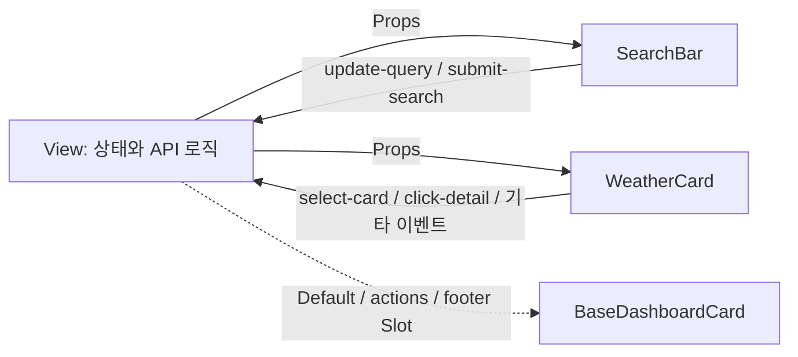

# SKALA Weather

Vue 3 수업의 날씨 종합 실습을 실제 서비스 흐름으로 확장한 프로젝트입니다. PDF의 기본 과제인 **Directive → Composition API → Component → Vue Router → Pinia → Axios → UI Library**를 하나의 앱으로 연결하고, 검색·즐겨찾기·도시 비교·날씨 지도·테마 기능을 추가했습니다.

> 이 문서는 기본 과제의 구현 여부보다, **과제에서 요구한 범위를 어떻게 변경하거나 추가로 활용했는지**에 중점을 두어 정리했습니다. 1장은 개발 환경 구성 중심이므로 첫 날씨 과제가 시작되는 PDF 2장부터 작성했습니다.

## 주요 화면

| 경로 | 화면 | 추가 구현 내용 |
| --- | --- | --- |
| `/` | 날씨 대시보드 | 실제 날씨, 한글 자모·다중 검색, 정렬, 요약 통계, 최근 검색, 도시 관리 |
| `/explore/search` | 대한민국 도시 검색 | 카카오 지역 후보, 현재 위치, 검색 도시의 대시보드·즐겨찾기 등록 |
| `/explore/map` | 날씨 지도 | Ventusky 지도와 OpenWeather 현재 날씨 연결 |
| `/compare` | 도시 비교 | 두 도시 검색, 실시간 날씨 비교, 비교 결과 자동 계산 |
| `/favorites` | 즐겨찾기 | 저장한 도시의 실제 날씨와 평균 기온 조회 |
| `/weather/:cityId` | 상세 날씨 | 현재 관측, 24시간 예보, 5일 요약, 생활 참고 안내 |

## 수업 개념별 핵심 차별점

| 학습 내용 | 과제 외 추가 활용 |
| --- | --- |
| Vue Directive | API 로딩·오류·빈 결과·정상 결과를 조건부 렌더링하고, 예보·검색 후보·경고·도시 카드를 반복 렌더링했습니다. 카드 내부 버튼에는 이벤트 버블링 방지를 적용했습니다. |
| `computed` | 한글 초성·자모 검색, 쉼표 다중 검색, 필터·정렬 파이프라인, 대시보드 통계, 즐겨찾기 통계, 시간별·일별 예보 요약, 도시 비교 결과를 계산했습니다. |
| `watch` / `watchEffect` | 상태바·검색어 감시뿐 아니라 URL query 동기화, 스토어 변경 후 API 재호출, 상세 도시 변경 감지, 최근 검색·즐겨찾기 저장, 테마 메타 색상 갱신에 활용했습니다. |
| Slot | `BaseDashboardCard`에 기본 Slot 외에도 `actions`, `footer` Named Slot을 추가해 여러 페이지의 공통 레이아웃으로 사용했습니다. |
| Props / Emits | `SearchBar`, `WeatherCard`, `LocationSuggestionList`를 표시 전용 자식으로 분리하고, 부모가 상태를 관리하는 단방향 데이터 흐름을 유지했습니다. |
| Pinia | 온도 단위뿐 아니라 대시보드 도시, 즐겨찾기, 검색한 도시, 라이트·다크 테마를 모든 라우트에서 공유하고 저장했습니다. |
| Axios / API | OpenWeather 현재 날씨·예보·역지오코딩과 카카오 지역 검색을 좌표 중심으로 연결했습니다. 병렬 요청, 제한 시간, 오류 상태, 오래된 응답 무효화도 처리했습니다. |
| UI Library | Element Plus 대신 PrimeVue를 적용하고, VueUse로 테마·저장소·검색 디바운스를 보완했습니다. |

## PDF 장별 확장 내용

### 2장. Vue 문법과 Directive

기본 과제의 `v-for`, `v-if`, 속성 바인딩, 이벤트 수식어를 다음과 같이 확장했습니다.

- 2단계였던 온도 문구를 `매우 더움 / 포근함 / 서늘함` 3단계로 변경했습니다.
- Mock Data 카드뿐 아니라 API 도시, 시간별 예보, 5일 예보, 카카오 지역 후보, 생활 참고 안내를 `v-for`와 고유한 `:key`로 렌더링합니다.
- `v-if / v-else-if / v-else`로 로딩, API 오류, 검색 전, 검색 결과 없음, 정상 결과를 구분했습니다.
- 검색창은 한글 IME 입력 과정이 자연스럽도록 `v-model` 대신 `:value`와 `@input`을 유지하고, 변경값을 Emit으로 부모에게 전달합니다.
- 카드 전체 클릭과 내부의 상세보기·즐겨찾기·삭제가 충돌하지 않도록 `@click.stop`을 적용했습니다.
- 정렬 Select, 즐겨찾기 전용 Toggle, 지도 도시 선택에는 `v-model`을 적용해 입력 방식에 따라 두 바인딩 방법을 비교했습니다.

### 3장. Composition API

#### `computed` 확장

- 완성형 한글을 검색용 자모로 분해합니다. 예를 들어 `서울`을 `ㅅㅓㅇㅜㄹ`로 바꾼 뒤 검색 목록을 계산하므로 `ㅅ`, `서ㅇ`, `서우`, `ㅅㅓㅇㅜㄹ` 모두 서울과 일치합니다.
- 쉼표로 검색어를 나눠 `서울, 부산`처럼 여러 도시를 한 번에 찾습니다.
- 검색 결과 → 즐겨찾기만 보기 → 기온·습도·이름 정렬 순서로 파생 목록을 계산합니다.
- **한눈에 보기**에서 등록 도시 수, 평균 기온, 가장 더운 도시, 즐겨찾기 수를 계산합니다.
- 검색 결과와 즐겨찾기 페이지의 개수·평균 기온, 두 도시의 기온·습도·풍속·기압 비교표도 원본 데이터가 바뀔 때 자동으로 다시 계산합니다.
- OpenWeather의 3시간 간격 예보 40개를 현지 날짜별로 묶고, 일별 최저·최고 기온과 최대 강수 확률을 계산해 5일 요약으로 가공합니다.

#### `watch`와 `watchEffect` 확장

- 과제에서 요구한 검색어 `watchEffect`와 상태바 문구 `watch` 로그를 유지했습니다.
- 검색어·정렬·즐겨찾기 필터를 URL query와 양방향으로 동기화해 새로고침과 뒤로가기 후에도 화면 상태를 복원합니다.
- Pinia의 대시보드·즐겨찾기 도시가 바뀌면 해당 페이지가 실제 날씨를 다시 불러옵니다.
- 동적 상세 경로의 `cityId`가 바뀌면 같은 컴포넌트에서 새로운 도시의 날씨와 예보를 다시 요청합니다.
- 대시보드·즐겨찾기·검색 도시와 최근 검색 변경을 감시해 브라우저 저장소에 반영합니다.
- 선택한 테마가 바뀌면 브라우저의 `theme-color`도 함께 갱신합니다.

파생값은 `computed`, API 호출·저장·라우팅처럼 상태 변경 뒤 실행해야 하는 동작은 `watch`로 구분했습니다.

### 4장. Vue Component

기본 4개 컴포넌트 분리에서 더 나아가, 같은 컴포넌트를 여러 라우트에서 재사용할 수 있도록 확장했습니다.

- `BaseDashboardCard`
  - 제목·설명은 Props로 받고, 본문은 Default Slot으로 주입합니다.
  - 헤더 버튼용 `actions`, 하단 버튼용 `footer` Named Slot을 추가했습니다.
  - 수업의 Slot 학습 목적을 유지하기 위해 PrimeVue Card로 교체하지 않고 직접 만든 공통 컴포넌트를 유지했습니다.
- `SearchBar`
  - 검색어와 표시 옵션을 Props로 받고 `update-query`, `submit-search` 이벤트를 Emits로 전달합니다.
  - 대시보드, 대한민국 도시 검색, 도시 비교의 좌·우 검색창에서 재사용합니다.
- `WeatherCard`
  - 날씨·즐겨찾기·대시보드 등록 상태를 Props로 받습니다.
  - 기본 `select-card`, `click-detail` 외에 `toggle-favorite`, `add-dashboard`, `remove-dashboard` 이벤트를 추가했습니다.
- `LocationSuggestionList`
  - 카카오 검색 후보, 로딩, 오류를 Props로 받고 사용자가 고른 지역 객체를 `select` 이벤트로 전달합니다.



각 자식 컴포넌트의 자체 스타일은 `scoped`로 격리했습니다. `BaseDashboardCard` 외곽과 Slot으로 주입된 콘텐츠를 함께 배치하는 규칙은 Slot 콘텐츠가 부모 스코프에서 컴파일되는 특성을 고려해 공통 스타일에 두었습니다.

### 5장. Vue Router

기본 홈·소개·동적 상세·Not Found 라우트에 실제 서비스형 화면 전환을 추가했습니다.

- 모든 View를 Lazy Loading하고 Catch-all Route를 유지했습니다.
- 탐색 화면을 중첩 라우트로 구성하고 검색과 지도를 하위 화면으로 분리했습니다.
- 즐겨찾기, 도시 비교, 날씨 지도 라우트를 추가하고 반응형 내비게이션에서 이동할 수 있게 했습니다.
- Mock Data의 `city_01` 대신 `위도_경도` 기반 키를 동적 `cityId`로 사용해 API로 검색한 도시도 상세 URL을 가질 수 있습니다.
- 검색어·정렬·즐겨찾기 필터와 비교할 두 도시를 URL query에 저장했습니다.
- 상세 화면은 진입한 화면에 따라 검색·지도·비교·즐겨찾기로 돌아갈 경로를 계산합니다.
- 대시보드 도시의 이전·다음 상세 페이지 이동, 경로별 문서 제목, 스크롤 위치 복원을 추가했습니다.

### 6장. Pinia Store

과제의 `configStore`를 유지하면서 실제 서비스 상태를 담당하는 `weatherStore`를 추가했습니다.

- `configStore`
  - 섭씨·화씨 상태, 단위 기호 Getter, 단위 전환 Action을 메인·카드·상세·비교·지도에 공통 적용했습니다.
  - 시스템·라이트·다크 테마 상태도 함께 관리합니다.
- `weatherStore`
  - 기본 대시보드 도시 5개, 사용자가 검색한 도시, 즐겨찾기 도시를 모든 라우트에서 공유합니다.
  - 도시 추가·삭제·기본값 복원·즐겨찾기 전환을 Action으로 제공합니다.
  - 좌표를 공통 식별자로 사용해 카카오와 OpenWeather의 도시명 표기가 달라도 같은 장소를 연결합니다.
  - 좌표가 같은 후보 중복 제거, 기본 도시 대표 좌표 재사용, 이전 숫자 ID 즐겨찾기 마이그레이션을 처리했습니다.
  - 새로고침 후에도 대시보드·즐겨찾기·검색 도시를 복원하도록 브라우저 저장소와 동기화했습니다.

### 7장. Axios와 외부 데이터

Mock Data는 기본 도시의 대표 좌표에만 사용하고, 화면에 표시되는 날씨는 실제 API 응답으로 교체했습니다.

```text
카카오 지역명 검색 → 대한민국 행정구역 후보와 좌표 선택
                    → OpenWeather 현재 날씨 조회
                    → 상세 화면에서 5 Day / 3 Hour Forecast 조회
```

- `axios.create()`로 OpenWeather 날씨, OpenWeather Geocoding, Kakao Local 인스턴스를 분리하고 공통 URL·인증 헤더·5초 제한 시간을 설정했습니다.
- OpenWeather 2.5의 Current Weather와 5 Day / 3 Hour Forecast를 사용합니다.
- 카카오 Local 주소 검색에서 대한민국 행정구역 후보를 받은 뒤, 선택한 좌표로 날씨를 조회합니다. 따라서 `계룡` 검색 시 임의의 OpenWeather 지명 하나를 바로 쓰지 않고 사용자가 `계룡시` 후보를 선택할 수 있습니다.
- 브라우저 Geolocation으로 현재 좌표를 받은 뒤 OpenWeather 역지오코딩으로 도시명을 확인하고 현재 날씨를 표시합니다.
- 대시보드와 즐겨찾기는 `Promise.allSettled()`로 여러 도시를 동시에 요청해 일부 도시 요청이 실패해도 성공 결과를 유지합니다.
- 상세와 도시 비교는 서로 독립적인 API를 `Promise.all()`로 병렬 호출합니다.
- 요청 순번을 두어 사용자가 도시를 빠르게 바꿨을 때 늦게 도착한 이전 응답이 최신 화면을 덮지 않게 했습니다.
- 상세 화면에서 24시간 예보, 5일 요약, 강수·기온·바람 기준 생활 참고 안내를 제공합니다. 생활 참고 문구는 앱에서 계산한 값이며 공식 기상 특보가 아님을 화면에 명시했습니다.
- 날씨 지도는 Ventusky의 좌표·레이어 기반 Embed를 사용하고, 선택 도시의 현재 수치는 OpenWeather에서 별도로 조회합니다.

### 8장. UI Library

수업에서 다른 UI 라이브러리 사용도 허용되어 Element Plus 대신 **PrimeVue**를 선택했습니다.

- PrimeVue `Button`, `Select`, `ToggleSwitch`, `Skeleton`, `Toast`, `ConfirmDialog`를 실제 대시보드 동작에 적용했습니다.
- 삭제·초기화는 ConfirmDialog로 확인하고, 검색·즐겨찾기·새로고침 결과는 Toast로 피드백합니다.
- Aura 테마를 바탕으로 기존 흑백 디자인에 맞는 색상 Preset을 구성했습니다.
- `data-theme`에 맞춰 PrimeVue와 자체 CSS가 함께 바뀌는 시스템·라이트·다크 모드를 구현했습니다.
- 필요한 PrimeVue 컴포넌트만 개별 import하고 각 View를 지연 로딩했습니다.

PrimeVue와 함께 **VueUse**도 적용했습니다.

- `useColorMode`: 시스템 테마 감지와 HTML 테마 속성 반영
- `useLocalStorage`: 온도 단위 저장
- `useDebounceFn`: 입력 중 불필요한 카카오 호출과 URL 변경 감소

## 검색을 두 흐름으로 분리한 이유

| 내 도시 검색 | 대한민국 도시 검색 |
| --- | --- |
| 이미 API로 불러온 대시보드 목록을 빠르게 필터링합니다. | 카카오 API에서 실제 대한민국 행정구역과 좌표를 찾습니다. |
| 초성·부분 자모·쉼표 다중 검색을 지원합니다. | 완성된 한글 두 글자 이상을 입력하면 후보를 보여줍니다. |
| 입력 즉시 `computed`가 결과를 계산하며 추가 API를 호출하지 않습니다. | 입력을 잠시 멈춘 뒤 API를 호출하고, 후보 선택 후 OpenWeather를 호출합니다. |

전국의 모든 장소에 초성 검색을 직접 적용하려면 먼저 전체 지명 데이터가 필요합니다. 따라서 로컬 대시보드에서는 학습한 검색 알고리즘을 활용하고, 실제 도시 탐색에서는 카카오 후보 선택으로 정확한 좌표를 얻도록 역할을 나눴습니다.

## 사용 API와 환경 변수

- OpenWeather Current Weather Data
- OpenWeather 5 Day / 3 Hour Forecast
- OpenWeather Reverse Geocoding
- Kakao Local 주소 검색
- Browser Geolocation API
- Ventusky Embed

프로젝트 루트의 `.env`에 다음 키를 설정합니다. 실제 키 값은 저장소에 올리지 않습니다.

```dotenv
VITE_OPENWEATHER_API_KEY=발급받은_OpenWeather_Key
VITE_KAKAO_REST_API_KEY=발급받은_Kakao_REST_API_Key
```

## 실행 방법

```sh
npm install
npm run dev
```

제출 전 확인:

```sh
npm run lint
npm run build
```

## 기술 스택

- Vue 3 Composition API
- Vue Router
- Pinia
- Axios
- PrimeVue
- VueUse
- Vite
